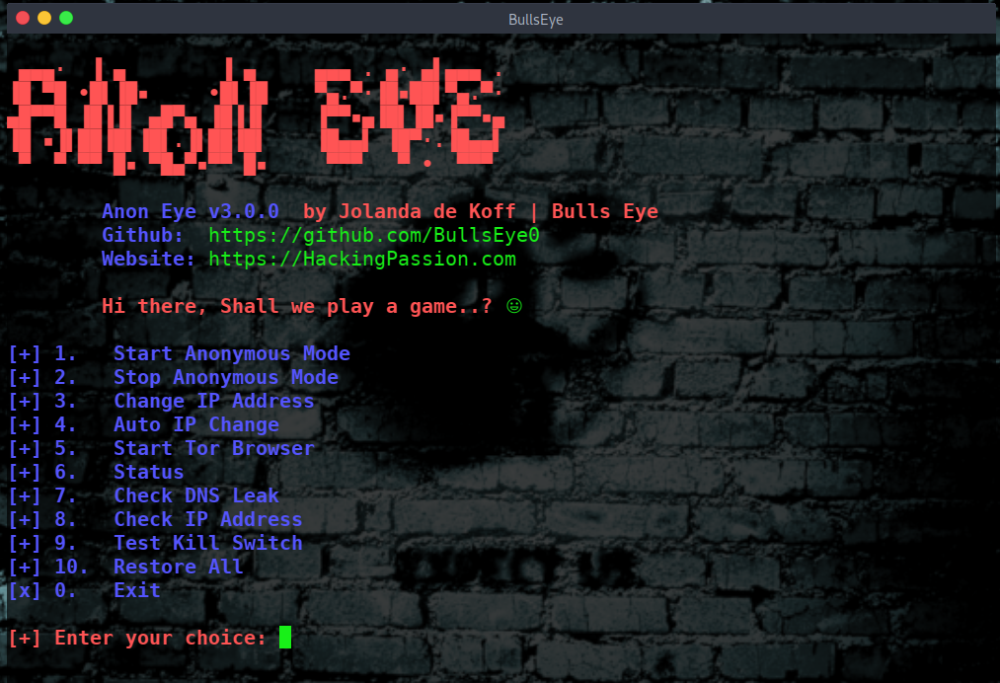
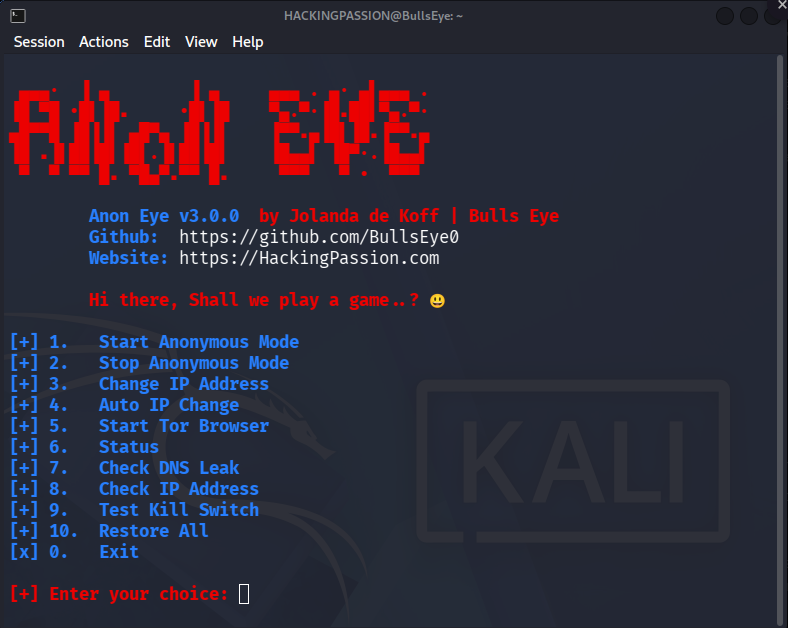

# Anon Eye



**Anon Eye** New Release. Anon Eye makes your machine anonymous. All outgoing TCP goes through Tor, your name lookups go to Tor's own resolver, and a kill switch stops everything the moment Tor falls away. This way, you work from a machine that does not put your own address on the connections it makes.

```
 ▄▄▄·  ▐ ▄        ▐ ▄     ▄▄▄ . ▄· ▄▌▄▄▄ .
▐█ ▀█ •█▌▐█▪     •█▌▐█    ▀▄.▀·▐█▪██▌▀▄.▀·
▄█▀▀█ ▐█▐▐▌ ▄█▀▄ ▐█▐▐▌    ▐▀▀▪▄▐█▌▐█▪▐▀▀▪▄
▐█ ▪▐▌██▐█▌▐█▌.▐▌██▐█▌    ▐█▄▄▌ ▐█▀·.▐█▄▄▌
 ▀  ▀ ▀▀ █▪ ▀█▄▀▪▀▀ █▪     ▀▀▀   ▀ •  ▀▀▀
```

Your terminal talks straight to the internet. A `curl`, a `wget`, an `apt update`, a scan you fire off without thinking: they all leave with your own address on the front. Tor Browser covers one program and leaves the rest of the machine exactly as it was.

I built this years ago, because it was not out there the way I wanted it. That was AnonSurf Eye. I rebuilt it from scratch, better than it was. Now it is online, so you can use it too. This is v3.

Anon Eye moves the machine instead of the program. One command and it is on: everything leaves over the tunnel, while your lab stays reachable on its own addresses so you keep working. Stop it, and your machine is as you left it, with your torrc, your resolver, your timezone, and your firewall rules back the way they were. Test that kill switch yourself, option 9 in the menu.

Hi there, shall we play a game..? 😃  
Start it, pick your option, and watch what leaves your machine and what does not.  
Jolanda de Koff | Bulls Eye!

## Features

* All outgoing TCP through Tor, with one command
* Name lookups go to Tor's own resolver, so your DNS stays away from your provider
* A kill switch that holds: with Tor down nothing gets out, not over TCP and not over ICMP. The browser user is the one way past it, with its own Tor, and only once Tor Browser is installed for that user
* Test that kill switch from the menu and watch it hold
* Your torrc is checked by Tor itself with `--verify-config` before the firewall changes. Does Tor say no, then nothing on your machine has changed
* After the restart it waits, up to thirty seconds, until Tor really listens on both ports. The firewall goes over after that and not before
* Another process sitting on the TransPort? It names that process and stops there. It does not fight over a port
* The Tor service and the Tor user are looked up on your own system, `tor@default` or `tor`, and `debian-tor`, `toranon` or `tor`. That is why Kali and Parrot both work without editing anything
* IPv6 off while it runs, so nothing leaves over IPv6 while your TCP goes through Tor
* Your clock on UTC while it runs
* A new Tor circuit whenever you want, or on a timer
* Tor Browser as its own user, with its own circuits, next to the system tunnel
* A DNS leak check that measures on your own machine instead of asking a website
* Check IP asks `check.torproject.org`, so Tor itself confirms you came out in the network
* A status screen with the service, the ports, the chains, IPv6, the resolver, the browser user, and the address the other side sees
* Your own IPv4 rules stay untouched. Anon Eye works in two chains of its own and takes only those away again
* DHCP stays open, so your machine keeps its lease while the kill switch is on
* Your resolver is handled both ways it can exist: a symlink with systemd-resolved is stopped and put back, a plain file is copied away, and the new one is locked with `chattr +i`
* Already running Tor ports of your own, like Parrot does? It uses those and writes nothing to your torrc
* It stops when Parrot AnonSurf is running, and when another transparent proxy already holds the redirect. It does not write over somebody else's work
* It refuses to touch `TransPort`, `DNSPort` or `ControlPort` lines you put in your torrc yourself, and shows you with line numbers which ones are in the way
* Ctrl-C is held off while it switches over, so you cannot drop out halfway and leave the machine in a half finished state
* Tor will not listen? You get the last warn and err lines out of journalctl, not a message that only says something failed
* `tor`, `iptables`, `ip6tables`, `curl`, `ss` and `dig` are checked before anything happens, and what is missing is installed if you say yes
* Everything it takes over is kept in `/var/lib/anon-eye`, chmod 700: your torrc, your resolv.conf and your timezone
* Restore All puts everything back whatever state it is in, and it cleans up by itself after a reboot or a hard stop

One thing it does not put back exactly: your IPv6 policies. While Anon Eye runs, the `ip6tables` policies for INPUT, OUTPUT and FORWARD are set to DROP, and on stop they are set to ACCEPT. Did you set those policies yourself, then set them again after you stop. Reading them out first and handing them back the way they were is on the list for a next version.

Here you can read an article I wrote about Anon Eye:

## Article:

https://hackingpassion.com/anon-eye/

## Video demo:

**[Video](https://hackingpassion.com)**

## Install and run on Linux

Anon Eye is a bash script. It needs root and a system with systemd.

Tested on Kali Linux and Parrot OS. Debian, Ubuntu, Linux Mint, Pop!\_OS, elementary and Zorin are recognised as well, and so is anything that calls itself Debian or Ubuntu based. On a system that is not on the tested list Anon Eye says so first and you decide whether to go on.

You do not have to install anything up front. Anon Eye checks for `tor`, `iptables`, `ip6tables`, `curl`, `ss` and `dig` before it does anything else. Is one of them missing, then it names it and installs it for you if you say yes. Tor Browser itself is fetched later, when you pick option 5, and only if it is not there yet.

## Installation Steps:

```bash
git clone https://github.com/BullsEye0/anon-eye.git
cd anon-eye
chmod +x anon-eye.sh
sudo ./anon-eye.sh
```

## How to use Anon Eye

```
[+] 1.   Start Anonymous Mode
[+] 2.   Stop Anonymous Mode
[+] 3.   Change IP Address
[+] 4.   Auto IP Change
[+] 5.   Start Tor Browser
[+] 6.   Status
[+] 7.   Check DNS Leak
[+] 8.   Check IP Address
[+] 9.   Test Kill Switch
[+] 10.  Restore All
[x] 0.   Exit
```



**1. Start Anonymous Mode.** Your torrc is copied away before a single line is written. Does your system already run Tor ports of its own, the way Parrot does, then it uses yours and leaves your file alone. Does it have to write, then the block goes between two markers and Tor checks it with `--verify-config` first, so a configuration Tor will not take changes nothing. After the restart it waits, up to thirty seconds, until Tor really listens on the TransPort and the DNSPort. Only then come the DNS lock, the two chains, IPv6 off and the clock on UTC, and it ends by showing you the address you came out on.

**2. Stop Anonymous Mode.** Takes the two chains out of OUTPUT, and keeps taking them out until there is nothing left, so a double jump from an earlier run goes with it. Your resolver, IPv6 and your timezone come back. Did it adopt your own Tor ports at the start, then your torrc was never touched and it tells you so. Wrote it its own block, then that block is stripped and Tor restarts on your own configuration.

**3. Change IP Address.** Asks Tor over the control port for `SIGNAL NEWNYM`: it reads the control cookie from disk, authenticates, and waits for `250 OK`. New circuits, and the DNS cache goes with them. A `kill -HUP` only reloads the configuration and does neither. Five seconds later your address is checked again, so you see the change.

**4. Auto IP Change.** The same, on a timer you pick yourself. Ten seconds is the floor and typing less gets you ten anyway, because Tor is allowed to rate limit this signal. The loop keeps running until you press `x` or `0`.

**5. Start Tor Browser.** Tor Browser gets a user of its own, `anonbrowser`, kept out of the redirect. Its TCP leaves directly and builds its own circuits next to the system tunnel, while its name lookups still go through Tor. Is Tor Browser not there for that user yet, then the download runs through the tunnel, so your provider sees Tor traffic and not a browser being fetched. That is slow, and once a minute you get a line with how long it has been busy. Run the tool with sudo from your own account, because the browser needs your screen.

**6. Status.** One screen with all of it: your distribution, whether the marker is set, whether Tor runs, all three ports, both chains, IPv6, your resolver, the browser user, and the address the other side sees. Something turns up red here and you know where to look.

**7. Check DNS Leak.** No leak test site involved. Anon Eye reads which resolver your machine asks, sends a query with `dig` and shows you the server that answered. Comes the answer from `127.0.0.1`, then Tor resolves your names on this machine. Comes the answer from anywhere else, then your names go out somewhere else too.

**8. Check IP Address.** Asks `check.torproject.org` which address you came out on. That answer comes from the Tor Project itself, so it is Tor telling you that you are in the network.

**9. Test Kill Switch.** Stops Tor for a moment and then tries to get out twice: over TCP with `curl` and over ICMP with `ping`. Both have to fail. One of them gets through and you know your setup leaks before you rely on it. Tor is started again when the test is done. Does it not come back, then Restore All cleans up. A kill switch you have not tested is not a kill switch.

**10. Restore All.** The same cleanup as Stop, and it runs whatever state the machine is in: after a reboot, after a hard stop, or when something went wrong halfway. Anon Eye does this check at startup too. Is the marker set while the firewall rules are gone, then it cleans up first and tells you what it did.

## How it works

Has your system no Tor ports of its own, then Anon Eye adds one block to `/etc/tor/torrc`, between two markers, so it comes out again without touching the rest of your file:

```
# AnonEye START
VirtualAddrNetworkIPv4 10.192.0.0/10
AutomapHostsOnResolve 1
TransPort 9040 IsolateClientAddr IsolateClientProtocol IsolateDestAddr IsolateDestPort
DNSPort 5353
ControlPort 9051
# AnonEye END
```

Before Tor is restarted the configuration goes past Tor itself with `--verify-config`, and after the restart Anon Eye waits until Tor really listens on both ports. Only then does the firewall change, so a mistake in the configuration never leaves you locked out. Port still held by something else? Anon Eye names the process that holds it and stops there.

The firewall work sits in two chains of its own, `AE_NAT` and `AE_OUT`, with one jump to each at the top of OUTPUT. Nothing is flushed, so rules from Docker or anything else you run stay where they are.

In `AE_NAT` the Tor user returns first, or Tor would send its own traffic back to itself. Then all DNS goes to Tor's resolver. The browser user returns next, so only its TCP leaves directly and its names are still looked up through Tor. That return only exists once Tor Browser is installed for that user. Is it not there yet, then that user goes through the tunnel like the rest of your machine.

Loopback returns, and so do the private ranges, which is why your lab stays reachable. `10.192.0.0/10` goes to the TransPort before those ranges return, because that is where your `.onion` addresses land and they would fall straight through the `10.0.0.0/8` rule. Everything else that opens a TCP connection is redirected to the TransPort.

`AE_OUT` ends on DROP. It lets through loopback, the Tor user, the browser user, connections that already exist, DHCP so the machine keeps its lease, and the private ranges. It drops invalid packets, it drops UDP, and it drops whatever is left. That is the kill switch.

Your resolver is handled both ways it can exist. A symlinked `resolv.conf` means systemd-resolved is stopped and put back later. A regular file is copied away and the new one is locked with `chattr +i`, so nothing can write over it while Tor is carrying your names.

## Good to know

Tor carries TCP, so UDP stays outside the tunnel. Your name lookups are the exception, those go to Tor's own resolver. Linux only, because Tor's TransPort needs a transparent proxy from the operating system. Your lab stays reachable on its addresses and not on its names, because the name lookups go through Tor.

Have fun ..!

## Contact to coder

My accounts:

Ethical Hacking Course:
→ https://www.udemy.com/course/ethical-hacking-complete-course-zero-to-expert/?couponCode=SEPTEMBER
 
→ YouTube Channel: https://www.youtube.com/@HackingPassion 
 
→ Website: https://hackingpassion.com 
 
→ GitHub (Tools): https://github.com/BullsEye0 
 
→ Facebook Page: https://www.facebook.com/ethical.hack.group/
 
→ LinkedIn: https://www.linkedin.com/in/jolandadekoff
 
→ Newsletter: https://hackingpassion.com/newsletter/
 
→ Facebook Personal: https://www.facebook.com/profile.php?id=100069546190609
 
→ Facebook Group: https://www.facebook.com/groups/ethical.hack.group/ 
 
→ LBRY/Odysee: https://lbry.tv/$/invite/@hackingpassion:9


***

## 💻 Support this project

If you find this tool useful, consider supporting my work:  
[❤️ Sponsor BullsEye](https://github.com/sponsors/BullsEye0)

Get the full hands-on course:  
**[Ethical Hacking Complete Course – Zero to Expert](https://www.udemy.com/course/ethical-hacking-complete-course-zero-to-expert/?couponCode=SEPTEMBER)**

(supports me directly as your instructor!)

Professional penetration testing. Zero to Expert.  
✅ Kali Linux + Parrot OS  
✅ Real-world hacking scenarios  
✅ All major tools & techniques  
✅ Beginner-friendly  

HACKING IS NOT A HOBBY, BUT A WAY OF LIFE 🎯

***

## Donate

I have developed Anon Eye because I am passionate about this.  
Donations are one of the many ways to support what I do.

[Donate](https://hackingpassion.com/donate/)

[](https://www.paypal.com/cgi-bin/webscr?cmd=_s-xclick&hosted_button_id=R96YN2PUS8V8W)

## License

Anon Eye is released under the GNU General Public License v3.0. Use it, change it, share it, and keep it open: passing it on means handing over the source and the same license with it. See the LICENSE file for the full text.

